# 実装工程表: v2.2改良項目

**作成日**: 2025-12-27  
**対象項目**: Novelモード実装、ファビコン最適化、ファイル名整理  
**基準文書**: [改良計画.md](file:///c:/Users/miura/WP_blog/1_WP_CM_blog/dev/document/pj_shirogami2_2/改良計画.md)

---

## 概要

本工程表では、v2.2改良項目のうち以下の3項目について実装手順を定義する。

| # | 項目 | 工数見積 | 優先度 |
|---|------|---------|--------|
| 1 | Novelモードの実装 | 2時間 | 中 |
| 2 | ファビコンの最適化 | 0.5時間 | 低 |
| 3 | ファイル名の整理 | 0.5時間 | 高 |

**合計工数**: 約3時間

---

## 1. Novelモードの実装

### 1.1 概要
Novel閲覧時の表示設定をユーザーがカスタマイズできる機能を実装する。設定はlocalStorageに保存し、次回アクセス時も適用される。

### 1.2 機能要件
- 白黒テーマ切り替え（ダークモード/ライトモード）
- 文字サイズ切り替え（大/中/小）
- 文字色・背景色のカスタム設定

### 1.3 実装ステップ

| Step | 作業内容 | 成果物 | 工数 |
|------|----------|--------|------|
| 1.3.1 | CSS定義ファイル作成 | `assets/css/novel-mode.css` | 30分 |
| 1.3.2 | JavaScript実装 | `assets/js/novel-mode.js` | 45分 |
| 1.3.3 | 設定UIの追加 | `_layouts/novel_episode.html` 修正 | 30分 |
| 1.3.4 | テスト・調整 | - | 15分 |

### 1.4 詳細仕様

#### 1.4.1 assets/css/novel-mode.css
```css
/* テーマ */
.novel-dark { background: #1a1a1a; color: #e0e0e0; }
.novel-light { background: #fff; color: #333; }
.novel-sepia { background: #f4ecd8; color: #5b4636; }

/* フォントサイズ */
.font-large article { font-size: 1.25rem; line-height: 2; }
.font-medium article { font-size: 1rem; line-height: 1.8; }
.font-small article { font-size: 0.875rem; line-height: 1.6; }

/* 設定パネル */
#novel-settings-panel { /* スタイル定義 */ }
```

#### 1.4.2 assets/js/novel-mode.js
```javascript
const NovelMode = {
  defaults: { theme: 'light', fontSize: 'medium', customBg: null, customFg: null },
  
  init() {
    this.settings = this.load() || { ...this.defaults };
    this.apply();
    this.setupUI();
  },
  
  save() {
    localStorage.setItem('novelSettings', JSON.stringify(this.settings));
  },
  
  load() {
    const data = localStorage.getItem('novelSettings');
    return data ? JSON.parse(data) : null;
  },
  
  apply() {
    document.body.classList.remove('novel-dark', 'novel-light', 'novel-sepia');
    document.body.classList.remove('font-large', 'font-medium', 'font-small');
    document.body.classList.add(`novel-${this.settings.theme}`);
    document.body.classList.add(`font-${this.settings.fontSize}`);
    
    if (this.settings.customBg) {
      document.body.style.backgroundColor = this.settings.customBg;
    }
    if (this.settings.customFg) {
      document.body.style.color = this.settings.customFg;
    }
  },
  
  setTheme(theme) { this.settings.theme = theme; this.apply(); this.save(); },
  setFontSize(size) { this.settings.fontSize = size; this.apply(); this.save(); },
  setCustomColors(bg, fg) { 
    this.settings.customBg = bg; 
    this.settings.customFg = fg; 
    this.apply(); 
    this.save(); 
  }
};

document.addEventListener('DOMContentLoaded', () => NovelMode.init());
```

#### 1.4.3 設定UI（novel_episode.html追加部分）
```html
<div id="novel-settings" class="fixed bottom-4 right-4 z-50">
  <button onclick="toggleSettingsPanel()" class="bg-gray-800 text-white p-3 rounded-full shadow-lg">
    ⚙️
  </button>
  <div id="novel-settings-panel" class="hidden absolute bottom-12 right-0 bg-white p-4 rounded-lg shadow-xl w-64">
    <h4 class="font-bold mb-3">表示設定</h4>
    <!-- テーマ選択 -->
    <div class="mb-3">
      <label class="text-sm">テーマ</label>
      <select onchange="NovelMode.setTheme(this.value)">
        <option value="light">ライト</option>
        <option value="dark">ダーク</option>
        <option value="sepia">セピア</option>
      </select>
    </div>
    <!-- フォントサイズ選択 -->
    <div class="mb-3">
      <label class="text-sm">文字サイズ</label>
      <select onchange="NovelMode.setFontSize(this.value)">
        <option value="small">小</option>
        <option value="medium">中</option>
        <option value="large">大</option>
      </select>
    </div>
  </div>
</div>
```

---

## 2. ファビコンの最適化

### 2.1 概要
現在のfavicon.ico（約450KB）を最適化し、読み込み速度を改善する。

### 2.2 現状分析
- 現在: `favicon.ico` - 458,130 bytes（約450KB）
- ICO形式は複数サイズの画像を内包するため、サイズが大きくなりがち

### 2.3 実装ステップ

| Step | 作業内容 | 成果物 | 工数 |
|------|----------|--------|------|
| 2.3.1 | 現在のICOから必要サイズを抽出 | 抽出画像 | 10分 |
| 2.3.2 | PNG形式に変換・最適化 | `favicon-16x16.png`, `favicon-32x32.png` | 10分 |
| 2.3.3 | head.htmlにlink要素追加 | `_includes/head.html` 修正 | 10分 |

### 2.4 詳細仕様

#### 2.4.1 ファビコンファイル構成（最適化後）
```
/favicon.ico           → 削除または最小サイズ版に置換
/favicon-16x16.png     → 新規作成（約1-2KB）
/favicon-32x32.png     → 新規作成（約2-4KB）
/apple-touch-icon.png  → 新規作成（180x180, 約5-10KB）
```

#### 2.4.2 _includes/head.html 追加内容
```html
<link rel="icon" type="image/png" sizes="32x32" href="{{ '/favicon-32x32.png' | relative_url }}">
<link rel="icon" type="image/png" sizes="16x16" href="{{ '/favicon-16x16.png' | relative_url }}">
<link rel="apple-touch-icon" sizes="180x180" href="{{ '/apple-touch-icon.png' | relative_url }}">
```

### 2.5 注意事項
- オンラインツール推奨: [RealFaviconGenerator](https://realfavicongenerator.net/)
- 元画像（512x512以上推奨）が必要な場合はユーザーに提供を依頼

---

## 3. ファイル名の整理

### 3.1 概要
意味のないファイル名を適切な名前にリネームし、管理性を向上させる。

### 3.2 リネーム対象

| 現在のファイル名 | 新ファイル名 | 理由 |
|-----------------|-------------|------|
| `tools/aaaaa.html` | `tools/speech_timer.html` | 意味のある名前に変更 |
| `tools/coount_moji.html` | `tools/character_counter.html` | typo修正＋英語名 |

### 3.3 実装ステップ

| Step | 作業内容 | 成果物 | 工数 |
|------|----------|--------|------|
| 3.3.1 | ファイルリネーム | 2ファイル | 5分 |
| 3.3.2 | `_data/tools.yml` の `url` 更新 | `_data/tools.yml` 修正 | 10分 |
| 3.3.3 | リダイレクト設定（任意） | `_redirects` or Jekyll redirect | 10分 |
| 3.3.4 | 動作確認 | - | 5分 |

### 3.4 詳細仕様

#### 3.4.1 _data/tools.yml 修正例
```yaml
# Before
- id: speech_timer
  url: /tools/aaaaa.html

# After
- id: speech_timer
  url: /tools/speech_timer.html
```

### 3.5 注意事項
- 既存の外部リンクが存在する場合、旧URLからのリダイレクトを設定することを推奨
- Jekyll用リダイレクトは `jekyll-redirect-from` プラグインが必要

---

## 実装スケジュール

### 推奨実行順序

```mermaid
gantt
    title 実装スケジュール
    dateFormat  HH:mm
    section Phase 1
    ファイル名整理 :a1, 00:00, 30m
    section Phase 2
    ファビコン最適化 :a2, after a1, 30m
    section Phase 3
    Novelモード実装 :a3, after a2, 2h
```



| 順番 | 項目 | 工数 | 開始条件 |
|------|------|------|---------|
| 1 | ファイル名の整理 | 30分 | なし |
| 2 | ファビコンの最適化 | 30分 | Phase 1完了後 |
| 3 | Novelモードの実装 | 2時間 | Phase 2完了後 |

---

## 完了条件

### 1. Novelモード
- [ ] ダーク/ライト/セピアテーマが切り替え可能
- [ ] 文字サイズ（大/中/小）が切り替え可能
- [ ] 設定がlocalStorageに保存され、リロード後も適用される
- [ ] 設定UIが適切に表示・動作する

### 2. ファビコン最適化
- [ ] ファビコンサイズが50KB以下に縮小
- [ ] 主要ブラウザでファビコンが正常に表示される
- [ ] Apple Touch Iconが設定されている

### 3. ファイル名整理
- [ ] 対象ファイルがリネームされている
- [ ] `_data/tools.yml` のURLが更新されている
- [ ] リネーム後のツールページが正常に動作する

---

*工程表作成: Antigravity AI*
